Nate Hiatt (natehiatt@gmail.com)

# Unitary Executive Theory of the Presidency

**Outline:**
1. Background
2. Data Understanding
3. Data Preparation
4. Initial Modelling 
5. Expanding Stopwords & More Modelling 
6. Trends Over Time
7. Conclusions 
8. Next Steps

# 1. Background

Check out the slide deck for this project [here](https://docs.google.com/presentation/d/1B2uV_2cF3dCh2GUc0W7YUQrF90ohmWFAeRAbNSKyQLI/edit?usp=sharing).

The unitary executive theory of the presidency holds that the presidency is the end-all, be-all when it comes to executive power. Significantly, such a belief implies that Congress can and should have no say over agencies that it created; now that they exist, they are solely under the direction of the president. (For one of the original formulations of the theory, see [Calabresi & Rhodes 1992](https://www.jstor.org/stable/1341727). For a contemporary response, see [Lessig & Sunstein 1994](https://www.jstor.org/stable/1123119). For a general overview of the literature and critique of the theory, see [Sunstein & Vermeule 2020](https://www.journals.uchicago.edu/doi/full/10.1086/714860).) As a result, as some scholars have argued, the locus of legislation within the US government has shifted from Congress to the presidency. This trend is furthered by Congress' willing abdication of their legislative responsibility. The result, according to many, is the rise of an Imperial Presidency. 

Our question here will be whether and to what extent executive orders have become more legislative in nature. It is worth noting at the outset that the unitary executive theory has much broader implications -- in particular, we are likely to see legislation happening also at the agency-rulemaking-level, which would also fall under the purview of the president's authority, per the theory. Still, examining executive orders will give us a good start in examining the extent to which the presidency has garnered more legislative powers. 

To do so, we'll build an NLP model based upon all legislation from 90 years, and all executive orders since Franklin D. Roosevelt's presidency -- the point which many presidential scholars identify as the start of the modern presidency. We'll take legislation as our positive class -- our "1" -- in training our supervised model, and executive orders as our negative class -- our "0". We'll then see how well our model can categorize legislative versus executive documents, and whether it has become more difficult to separate the two over time -- as the unitary executive theory of the presidency would suggest. 

# 2. Data Understanding

The `executive_orders.csv` dataset includes the title, text, date of issue, and order numbers for all executive orders from March 8, 1933 (Order No. 6071) until October 30, 2023 (Order No. 14110). The dataset contains 2,253 total entries. The executive orders were largely collected from [Wikisource](https://en.wikisource.org/wiki/Category:United_States_executive_orders). The full code that was used to scrape Wikisource can be found in `wiki_scraping.ipynb`, inside the `notebooks` folder.

The `laws_cleaned.csv` contains legislation number, title, sponsor, date of introduction, and text for every public law from Congress beginning with the 113th Congress (2013-2015) until the 117th Congress (2021-2023). There are more than 1,300 entries in this dataset. These data were collected using congress.gov
The `laws_cleaned.csv` contains legislation number, title, sponsor, date of introduction, and text for every public law from Congress beginning with the 113th Congress (2013-2015) until the 117th Congress (2021-2023). There are more than 1,300 entries in this dataset. These data were collected using the official API of [congress.gov](https://www.congress.gov/). Documentation can be found [here](https://github.com/LibraryOfCongress/api.congress.gov). The full code used to pull these data can be found in `law_scraping.ipynb`, inside the `notebooks` folder.

# 3. Data Preparation

A number of steps were required in order to make the text data of the executive orders and the laws machine readable:
1. All text was made lower-case; punctuation was removed.
2. The text was tokenized -- made into a list of individual words -- and stopwords (words with little to no semantic meaning, or that were removed for other reasons) were removed.
3. Each token was tagged according to its part of speech (PoS). Words were mapped as adjectives, nouns, verbs, or adverbs. From there, I then lemmatized the words, so that we just have the root word. This allows for easier comparison.

After this first cleaning, we can get a very basic look at the words we're dealing with by producing a couple of word clouds:

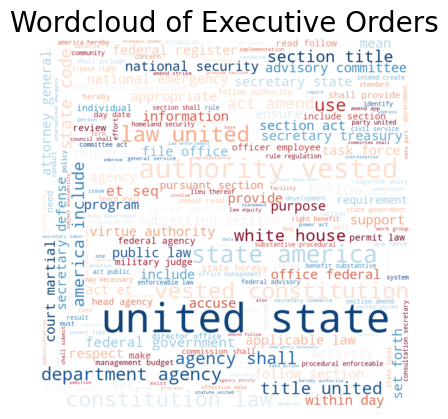

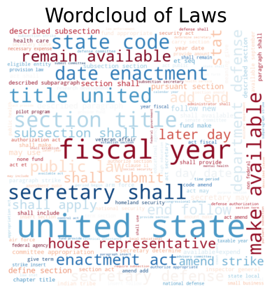

- NLP: cleaned and tokenized the text.
- Vectorizing to get relative word importance.

# 4. Initial Modelling

- Started with relatively few stopwords
    - Ran three different models, all of which could easily predict whether a document was executive or legislative. 
    - We can maybe see a change in the ease with which something can be classified as legislation post-1970, but it's far from clear. 
    - Executive orders seem to rely much more on claims of authority an legitimacy; legislation much less so.

- Repeated with filtered stopwords. Getting rid of artefacts and authorization-related words.
    - Similar results.

- Even more restricted stopwords.

As we will see, our models all performed well -- they had over 99% accuracy. This stands in sharp contrast to a baseline dummy predictor -- if we just took the majority class as our predictor, we would correctly predict the class of document around 63% of the time.

## 4.i Intiial Multinomial Naive Bayes

Running a very basic Multinomial Naive Bayes model, and grid searching it along with the Tf-IDF vectorizer, it turns out that (1) our model performs extremely well -- 99.5% accuracy -- and (2) that using trigrams exclusively (rather than *also* using unigrams and bigrams) gives us the best model in terms of accuracy of classifications.

The confusion matrix for this first model demonstrates the model's overall performance:

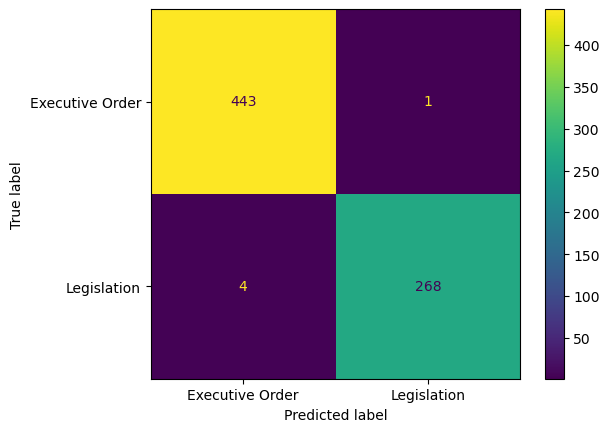

One of the advantages of running a Multinomial Naive Bayes model is that we can use `.proba` to get the probabilities that any given document within our corpus will be classified as either our positive class (in this case, legislation) or our negative class (in this case, executive order). By subtracting the latter probability from the former, we get the overall likelihood that a given document is classified as part of the positive class. 

We can also apply the same logic to our various n-grams -- in this case, our trigrams. A higher value indicates that the trigram was more salient (or more helpful) in classifying a given document as part of either the positive or negative class. You can see the values corresponding to the n-grams below:

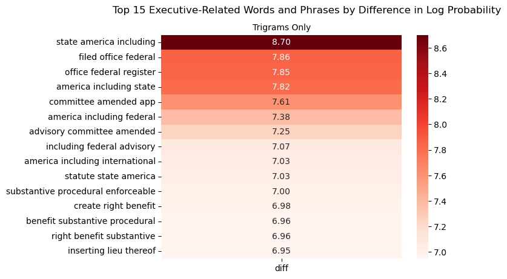

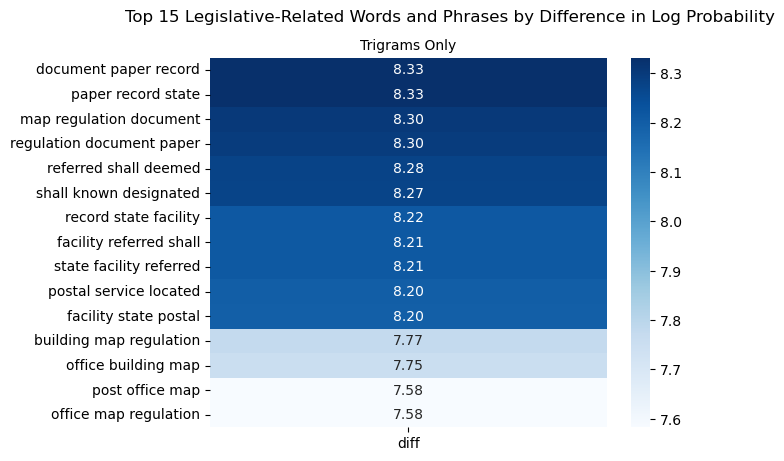

The main takeaways here are:
1. Executive orders rely heavily on claims to authority or legitimacy: "vested constitution law," "virtue authority vested," "authority vested constitution," and so on.
2. Legislation, in contrast, is much more formal and self-referential -- very "legalized," in the more pejorative sense of the word. There are also a large number of laws related to the (re-)naming of Post Offices, including but not limited to "postal service locate." Even more appear in the list of unigrams below.
3. A decent amount of the more important words obviously correspond to executive or legislative texts, but are not helpful for creating a generalizable model. Such words n-grams include "follow white house," "state commander chief," and "act may cite," among others. 

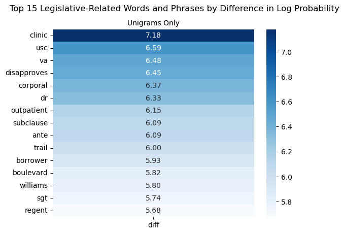

## 4.ii Initial Random Forest

The initial Random Forest is an even more effective classifier; it has an accuracy of 99.65%. We can again see the importance of authorization- and legitimacy-focused language ("vested," "authority," "constitution), and Post-Office-related words ("map").

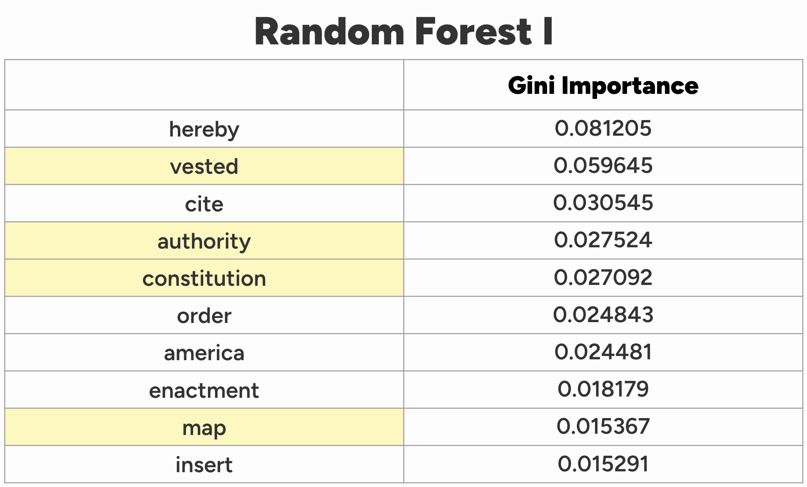

## 4.iii Initial XGBoost

The initial XGBoost also performs extremely well; it has an accuracy of 99.5%. From this model, we can once again see the importance of authorization-related langauge ("authoriy vested," "vested"), as well as some overly-obvious language that will not help in building a generalizable model ("white house").

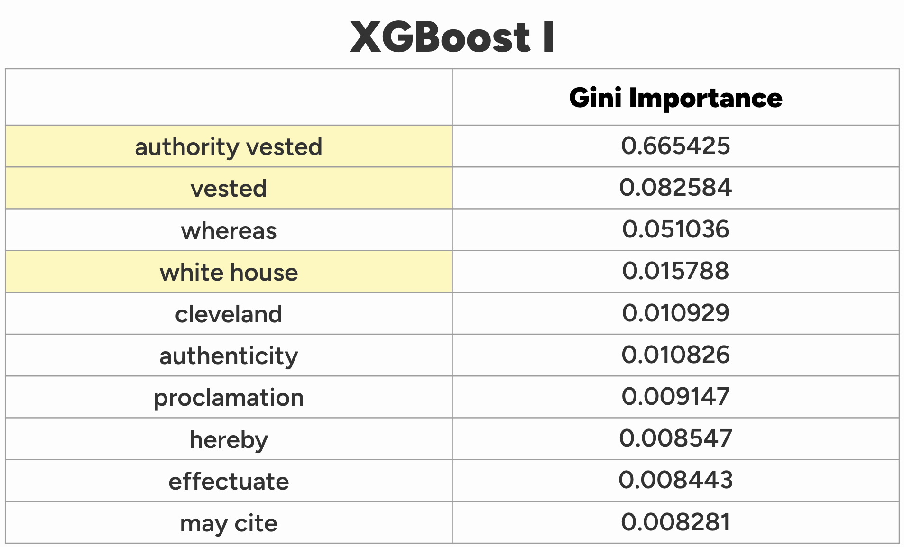

# 5. Expanding Stopwords & More Modelling

Our next step, then, is to expand our list of stopwords and filter out laws that are simply (re-)naming Post Offices (since these are procedural in nature, and will always clearly be the exclusive purview of Congress).

Our full list of added stopwords include: "reaganthe", "commander", "chief", "white", "house", "authority", "vested", "constitution", "authorized", "whereas", "hereby", "united", "states", "ordered", "follows", "act", "law", "resolution", "cited", "reference", "subsection", "paragraph".

Incredibly, nearly 20% -- 263 out of 1,323 total laws -- that end up being enacted by Congress involve the (re-)naming of Post Offices. Since these laws don’t tell us much relevant to our purposes -- the naming of Post Offices is explicitly and always will be the exclusive purview of Congress, and thus not helpful in investigating our puzzle -- we’ll go ahead and remove them from the corpus.

## 5.i Updated Multinomial Naive Bayes

We repeat the process of extracting the relative feature importances from the Naive Bayes model -- finding the most important terms for classifying texts as either executive or legislative. This time, both types of text are more formalistic. Notably, executive orders tend to rely much more heavily on the word "America." There's two ways to look at this: on the one hand, presidents are the only national representative that the US has, so it makes sense that they would have a national focus; on the other hand, executive orders might tend to appeal to a logically suspect concept of a national mandate in order to lend the order more authority or legitimacy than it really has.

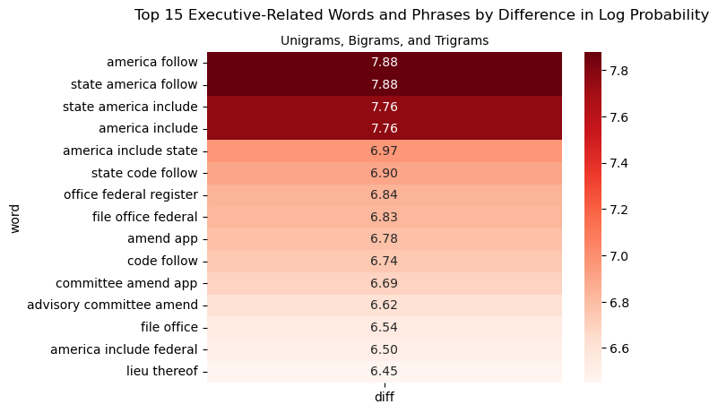

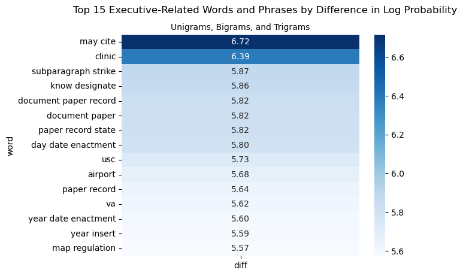

## 5.ii Updated Random Forest

The RF model still performs well -- 98.98% accuracy. The use of the word "America" still seems to be the most important takeaway.

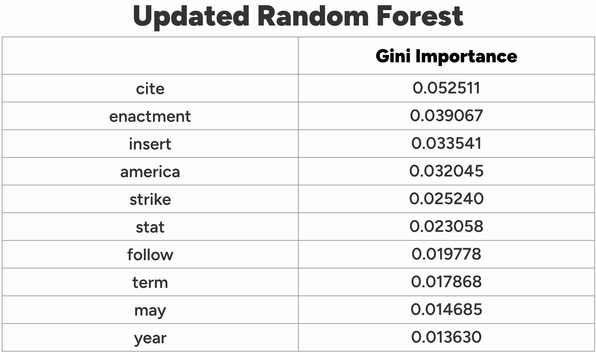

## 5.iii Updated XGBoost

The accuracy of the XGBoost is now 99.13%, making it our most accurate model. Once again, "America" is important, although "may cite" and "date enactment" are by far the most important n-grams.

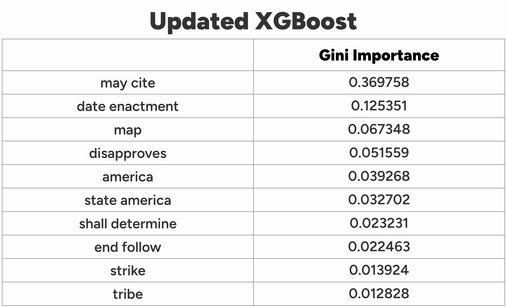

# 6. Trends Over Time

We can now take a look at our difference in log probability by year. The blue is our executive corpus; the red is legislation. The higher up a given year is on the y-axis, the more easily could the executive orders be correctly classified as executive. Put another way, if executive orders were becoming more legislative, we would expect to see a line with a negative slope. 

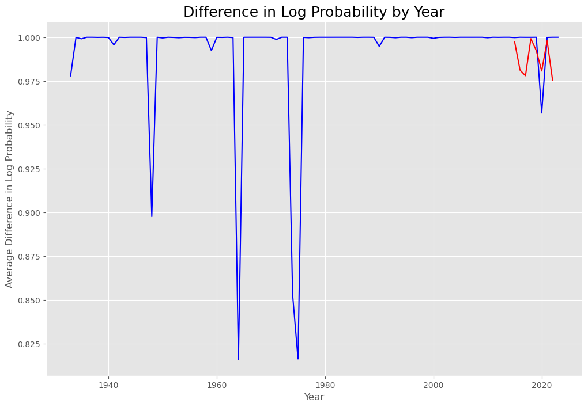

With our updated model (below) we might see a slight difference in the post-2000 executive orders, but it’s far from clear. Perhaps more interesting, 1974-6, immediately post-Watergate and when you have the White House legal team formulating the nascent Unitary Executive Theory, is the point at which the model has the most difficult clearly classifying executive orders correctly -- or, in other words, when executive orders appear to be the most legislative. 

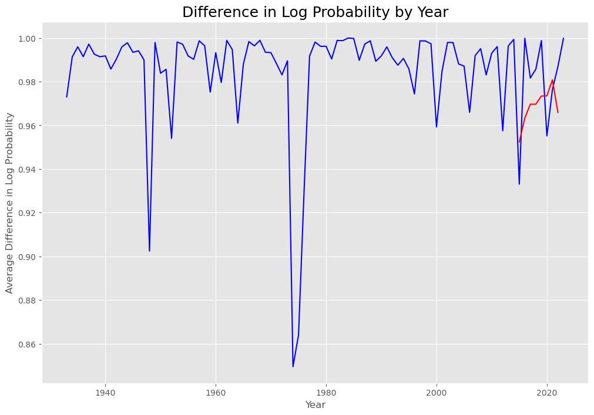

# 7. Conclusions

1. Executive orders and legislation are, at baseline, very easy to differentiate. That remains true even after we get rid of some of the formal language that indicates that a text is executive or legislative.
2. We may start to see changes around 1970, but there is no clearly discernible trend. There’s a weird dip post-Watergate which one might not expect, but which may also correspond to the beginnings of the formulation of the UET.
3. Executive orders show a concern with legitimization and authorization that we do not see in legislation. Further, there seem to be claims to national representation which Congress cannot and need not make.
4. As touched on below, this analysis should be expanded to include agency-created and rule-making-related documents, not merely executive orders. Such analysis would likely need to be complemented by historical and interview-based approaches to elicit the connections between agency documents and White House direction.

# 8. Next Steps

1. First, we should expand beyond purely executive orders, to agency rule-making more generally. This will be fraught with complications, but it surely could be the case that much of the “executive legislation” occurs within agencies, under the direction of the White House.
2. Second, we could pull in legislation from a much longer time period. It is definitely possible that contemporary legislation already bakes-in the abdication of much legislative activity to the executive.
3. Finally, there is great historical work on the topic; combining this data-driven analysis with historical explanations would prove fruitful.
4. Include other unsupervised learning models -- especially topic-based clustering, which might reveal that the topics of executive orders have changed over time.
