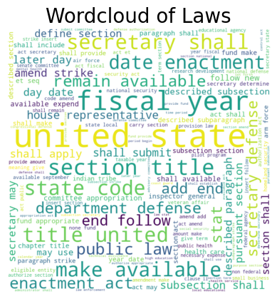

# Unitary Executive Theory of the Presidency

# 1. Background

The unitary executive theory of the presidency holds that the presidency is the end-all, be-all when it comes to executive power. Significantly, such a belief implies that Congress can and should have no say over agencies that it created; now that they exist, they are solely under the direction of the president. As a result, as some scholars have argued, the locus of legislation within the US government has shifted from Congress to the presidency. This trend is furthered by Congress' willing abdication of their legislative responsibility. The result, according to many, is the rise of an Imperial Presidency. 

Our question here will be whether and to what extent executive orders have become more legislative in nature. It is worth noting at the outset that the unitary executive theory has much broader implications -- in particular, we are likely to see legislation happening also at the agency-rulemaking-level, which would also fall under the purview of the president's authority, per the theory. Still, examining executive orders will give us a good start in examining the extent to which the presidency has garnered more legislative powers. 

To do so, we'll build an NLP model based upon all legislation from [THE PAST XXXX YEARS], and all executive orders since Franklin D. Roosevelt's presidency -- the point which many presidential scholars identify as the start of the modern presidency. We'll take legislation as our positive class -- our "1" -- in training our supervised model, and executive orders as our negative class -- our "0". We'll then see how well our model can categorize legislative versus executive documents, and whether it has become more difficult to separate the two over time -- as the unitary executive theory of the presidency would suggest. 

# 2. Data Understanding

The `executive_orders.csv` dataset includes the title, text, date of issue, and order numbers for all executive orders from March 8, 1933 (Order No. 6071) until October 30, 2023 (Order No. 14110). The dataset contains 2,253 total entries. The executive orders were largely collected from [Wikisource](https://en.wikisource.org/wiki/Category:United_States_executive_orders). The full code that was used to scrape Wikisource can be found in `wiki_scraping.ipynb`, inside the `notebooks` folder.

The `laws_cleaned.csv` contains legislation number, title, sponsor, date of introduction, and text for every public law from Congress beginning with the 113th Congress (2013-2015) until the 117th Congress (2021-2023). There are more than 1,300 entries in this dataset. These data were collected using congress.gov
The `laws_cleaned.csv` contains legislation number, title, sponsor, date of introduction, and text for every public law from Congress beginning with the 113th Congress (2013-2015) until the 117th Congress (2021-2023). There are more than 1,300 entries in this dataset. These data were collected using the official API of [congress.gov](https://www.congress.gov/). Documentation can be found [here](https://github.com/LibraryOfCongress/api.congress.gov). The full code used to pull these data can be found in `law_scraping.ipynb`, inside the `notebooks` folder.

# 3. Data Prep

A number of steps were required in order to make the text data of the executive orders and the laws machine readable:
1. All text was made lower-case; punctuation was removed.
2. The text was tokenized -- made into a list of individual words -- and stopwords (words with little to no semantic meaning, or that were removed for other reasons) were removed.
3. Each token was tagged according to its part of speech (PoS). Words were mapped as adjectives, nouns, verbs, or adverbs. From there, I then lemmatized the words, so that we just have the root word. This allows for easier comparison.

After this first cleaning, we can get a very basic look at the words we're dealing with by producing a couple of word clouds:

- NLP: cleaned and tokenized the text.
- Vectorizing to get relative word importance.

# 4. Initial Modelling

- Started with relatively few stopwords
    - Ran three different models, all of which could easily predict whether a document was executive or legislative. 
    - We can maybe see a change in the ease with which something can be classified as legislation post-1970, but it's far from clear. 
    - Executive orders seem to rely much more on claims of authority an legitimacy; legislation much less so.

- Repeated with filtered stopwords. Getting rid of artefacts and authorization-related words.
    - Similar results.

- Even more restricted stopwords.

## 4.i Intiial Multinomial Naive Bayes

Running a very basic Multinomial Naive Bayes model, and grid searching it along with the Tf-IDF vectorizer, it turns out that (1) our model performs extremely well -- 99.5% accuracy -- and (2) that using trigrams exclusively (rather than *also* using unigrams and bigrams) gives us the best model in terms of accuracy of classifications.

The confusion matrix for this first model demonstrates the model's overall performance:

One of the advantages of running a Multinomial Naive Bayes model is that we can use `.proba` to get the probabilities that any given document within our corpus will be classified as either our positive class (in this case, legislation) or our negative class (in this case, executive order). By subtracting the latter probability from the former, we get the overall likelihood that a given document is classified as part of the positive class. 

We can also apply the same logic to our various n-grams -- in this case, our trigrams. A higher value indicates that the trigram was more salient (or more helpful) in classifying a given document as part of either the positive or negative class. You can see the values corresponding to the n-grams below:

The main takeaways here are:
1. Executive orders rely heavily on claims to authority or legitimacy: "vested constitution law," "virtue authority vested," "authority vested constitution," and so on.
2. Legislation, in contrast, is much more formal and self-referential -- very "legalized," in the more pejorative sense of the word. There are also a large number of laws related to the (re-)naming of Post Offices, including but not limited to "postal service locate." Even more appear in the list of unigrams below.
3. A decent amount of the more important words obviously correspond to executive or legislative texts, but are not helpful for creating a generalizable model. Such words n-grams include "follow white house," "state commander chief," and "act may cite," among others. 

## 4.ii Initial Random Forest

The initial Random Forest is an even more effective classifier; it has an accuracy of 99.65%. We can again see the importance of authorization- and legitimacy-focused language ("vested," "authority," "constitution), and Post-Office-related words ("map").

## 4.iii Initial XGBoost

The initial XGBoost also performs extremely well; it has an accuracy of 99.5%. From this model, we can once again see the importance of authorization-related langauge ("authoriy vested," "vested"), as well as some overly-obvious language that will not help in building a generalizable model ("white house").

# 5. Expanding Stopwords & More Modelling

Our next step, then, is to expand our list of stopwords and filter out laws that are simply (re-)naming Post Offices (since these are procedural in nature, and will always clearly be the exclusive purview of Congress).

Our full list of added stopwords include: "reaganthe", "commander", "chief", "white", "house", "authority", "vested", "constitution", "authorized", "whereas", "hereby", "united", "states", "ordered", "follows", "act", "law", "resolution", "cited", "reference", "subsection", "paragraph".

A shockingly large percentage of laws passed by Congress are simply (re-)naming Post Offices -- since the 113th Congress, 263 out of 1,323 total laws. These entries are filtered out of the corpus.

## 5.i Second Multinomial Naive Bayes

## 5.ii Second Random Forest

## 5.iii Second XGBoost

# 6. Conclusions and Next Steps

- Not clear, but the data certainly don't rule out the validity of the unitary executive theory of the presidency. To the extent that we can see anything, it would imply support.
- Need to repeat this with agency rule-making, although that will likely always be relatively legislative -- the question would be the relative influence that the President has over the direction of these rules, and that wouldn't necessarily or obviously be clear simply by analyzing the text, without adding the corresponding historical work.